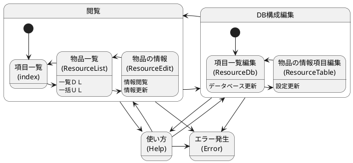
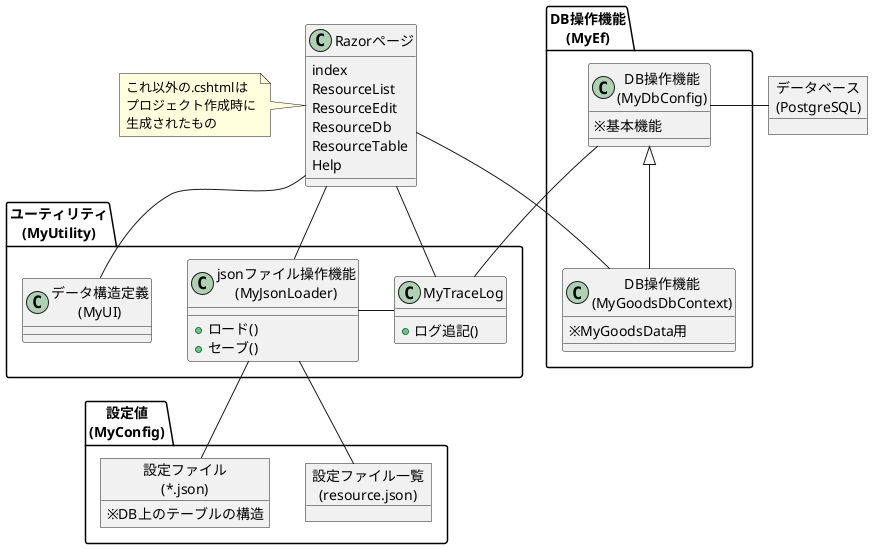

@import "doc.less"

# GoodsManagement

## 概要設計

### ページ構成



### 内部構造



## 詳細設計

### DBに作成するテーブルのデータ構造

- とりあえずは第1正規形とする
  - それ以上の正規化は必要になったら考える
  - というより、項目を可変にしているため、ユーザーが考えて使わないとダメなはず

|名前|説明|
|-|-|
|Serial|シリアルNo、DBMSで採番|
|Update|レコードの最終更新日時<br>レコードの更新の際に前回取得した際に、<br>・事前に取得していた値との一致チェックを行う<br>・一致しなかった場合は競合が発生したと判断してエラーとする|
|Name|レコードの名前|
|Thumbnail|画像のURL|
|Explain|上記以外の項目、項目数は可変|

### 「resource.json」ファイルのデータ構造

|名前|説明|
|-|-|
|Name|Webページのプログラムで使用するキーワード<br>※半角英数字のユニークな値|
|Title|Webページに表示される項目名|
|Config|DBに作成するテーブルの構造を定義したjsonファイル名<br>※Nameで使用した値 ＋ ".json"|

### DBに作成するテーブルの構造を定義したjsonファイルのデータ構造

|名前|説明|
|-|-|
|TableName|DBに作成するテーブル名<br>※半角英数字のユニークな値、英大文字も小文字として扱う|
|MenuType|「DBに作成するテーブルのデータ構造」に記載がある「Explain」の設定|
|MenuItem|テーブルに登録されているレコード一覧<br>※必要な情報はアプリケーションがDBから引っ張ってくるためjsonファイルとしては空の配列|
<br>

MenuTypeのデータ構造
|名前|説明|
|-|-|
|Name|項目名<br>※半角英数字のユニークな値、英大文字も小文字として扱う<br>※既に使用済みの値：Serial、Update、Name、Thumbnail|
|DbType|この項目のDBのテーブル上のデータ型<br>※「text」を設定する|
|Primary|この項目を主キーにするかどうか<br>※基本はFalse(主キーはSerialだけで必要十分かと)|
|Option|選択肢<br>※文字列のリスト<br>※データが存在する場合はWebページでの入力がコンボボックスrになる|
|View|レコードの一覧表示の際の表示有無設定|

## コーディング

### 制約事項

- ASPのアプリケーションのリンクでは「/」で始まるURLの使用を禁止
  ※「/」で始まるものはAPSアプリケーションのルート(http://localhost:5000/)になるため、他のサービスと共存させる場合に狙った動作にならない
  ※「Startup.cs」を改造することでルートを変更できそうな雰囲気はするのですが、理解できなかったので諦めた

## デプロイ

### Windows10＋Apach2.4＋PostgreSQLで動かす

- Apach、PostgreSQLのセットアップは他のサイトを参照
- 以下の手順でWebサーバーとして稼働しているApachにASP.NETアプリを組み込む

1. Visual Studioでプロジェクトをフォルダに発行する
1. 「GoodsManagement.exe」を起動する
   ※サービスとして登録して自動起動させるほうが良いが、めんどくさくなったのでやめた
1. 「httpd.conf」を修正(以下の2行の先頭の「#」を削除)
    ```text
    LoadModule proxy_module modules/mod_proxy.so

    LoadModule proxy_http_module modules/mod_proxy_http.so
    ```
1. 「httpd.conf」に追記

    ```txt
    #
    # ASP.Net
    #
    ProxyPass /ASPNetApp/gm/ http://localhost:5000/
    ProxyPassReverse /ASPNetApp/gm/ http://localhost:5000/
    ```
1. Apachを起動
   「http://localhost/ASPNetApp/gm/」でアクセスできる
